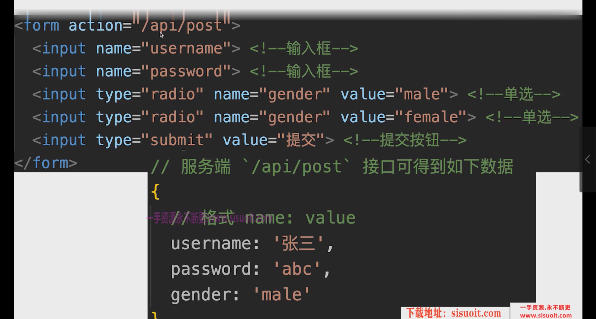

# SSR的两种形式
1. 静态直出html - 如提交失败的页面 - static generation - 项目构建时，直接产出html文件
2. 动态拼接html - service-side render - 根据每次请求动态生成html文件
# getStaticProps & getServerSideProps
1. getStaticProps 只有在build才会执行一次，因此线上环境后，不会每次请求都执行
2. getServerSideProps 线上环境，每次请求都会执行

#  动态路由，获取url参数
1. 创建[params]文件
# B端和C端的url要统一
1. B端复制的访问c端的url：http://localhost:3000/question/360000202306055213
2. C端建立起的获取参数url形式：http://localhost:3000/question/12133
3. 这样复制c端的访问链接时，C端就能获取到传过来的id

====

# form问卷提交
* 以h5问卷页面为例
1. 获取问卷数据
2. 根据组件列表，显示表单
3. 用户填写表单，提交数据
 * Q：数据如何提交？
 * A：ajax提交 || form 纯html提交
 * 纯html form表单提交，更简单，兼容性更好，性能更好，适合单页面形式

 # 提交表单
 1. 新建api，并写入form action中，且设置method为post
 2. 新建service，封装get&post方法
 3. 服务端新建mock数据，用于收集答卷数据

 # 封装组件

 # 处理错误

 # 获取问卷信息
